# Database Schema (Water Business Management)

This project’s frontend screens imply a small ERP for a water delivery business: customers, employees/salesmen, vendors, products, sales/invoices, payments, deposits, purchases, stock movements, and expenditure.

This document describes a **normalized relational schema** (PostgreSQL-first) that keeps relationships clean between modules and supports reporting screens (ledger, outstanding, stock balance, daily sales, etc.).

## Conventions

- **Naming**: `snake_case` table/column names.
- **Primary keys**: `bigint generated ... as identity` named `id`.
- **External “Account #”**: stored as `code` (e.g., `CUST-001`, `EMP-001`) with `UNIQUE`.
- **Status fields**: stored as `text` with `CHECK (...)`.
- **Timestamps**: `created_at`, `updated_at` on most tables.
- **Money**: `numeric(12,2)` (easy/clear for business apps).

## Module → table mapping (from your UI)

- **Settings → Areas**: `areas`
- **Employees → Add/Manage**: `employees`, `users` (optional login), `roles`, `user_roles`
- **Employees → Assign Areas**: `employee_areas`
- **Settings → Banks**: `banks`
- **Products → Categories**: `product_categories`
- **Products → Add/Manage**: `products`
- **Settings → Price**: `product_prices` (default price history)
- **Customers → Add/Manage**: `customers`, `customer_credentials` (optional mobile login)
- **Customers → Set Product Price**: `customer_product_prices` (customer-specific overrides)
- **Customers → New Order / Sales → New Order**: `sales_invoices`, `sales_invoice_items`
- **Customers → Payment / Payments → Receive**: `customer_payments` (+ optional `customer_payment_allocations`)
- **Payments → Security Deposit**: `customer_security_deposits`
- **Payments → Refund Deposit**: `customer_security_refunds`
- **Vendors → Add/Manage**: `vendors`
- **Vendors → Purchase**: `vendor_purchases`, `vendor_purchase_items`
- **Vendors → Payment**: `vendor_payments` (+ optional `vendor_payment_allocations`)
- **Stock → Filling / Filling History**: `stock_locations`, `stock_movements` (movement_type = `FILLING`)
- **Stock → Damage**: `stock_movements` (movement_type = `DAMAGE`)
- **Stock → IN/OUT**: `stock_movements` (movement_type = `IN`/`OUT`/`RETURN`)
- **Expenditure**: `expense_heads`, `expenses`

## Core entities (high-level)

### People & access

- **`employees`**: business staff (salesman/driver/office staff), their account code, contact, and active status.
- **`users`**: optional login accounts (admin panel); can link 1:1 to an employee.
- **`roles`**, **`user_roles`**: role-based access control.

### Geography / routing

- **`areas`**: delivery areas/zones.
- **`employee_areas`**: assigns one or many areas to a salesman (matches “Assign Areas” screen).

### Parties

- **`customers`**: assigned area, contact, delivery days, required bottles, opening balance, active/inactive.
- **`customer_credentials`**: optional mobile-app login (username + password hash).
- **`vendors`**: suppliers for purchases and vendor payments.

### Products & pricing

- **`product_categories`**: 19L, Disposable, Accessories.
- **`products`**: product master (status, category, bottle_type, is_returnable).
- **`product_prices`**: default price history per product (effective-dated).
- **`customer_product_prices`**: special price override per customer per product (effective-dated).

### Sales & receivables

- **`sales_invoices`**: one invoice/bill for a customer on a date, with optional salesman.
- **`sales_invoice_items`**: product lines; includes:
  - `sale_qty` (S-Quantity)
  - `return_qty` (Return Quantity, e.g., empties returned for 19L)

### Payments & deposits

- **`customer_payments`**: cash/bank/cheque received; supports bank/cheque fields and a receiver employee.
- **`customer_payment_allocations`** (optional): allocates a payment across one or many invoices (useful if you want invoice-wise outstanding).
- **`customer_security_deposits`**, **`customer_security_refunds`**: tracks deposit movements separately (matches screens).

### Purchasing & payables

- **`vendor_purchases`** and **`vendor_purchase_items`**: purchasing transactions.
- **`vendor_payments`**: payments made to vendors.
- **`vendor_payment_allocations`** (optional): allocate vendor payments to purchases.

### Stock (warehouse + per-salesman / market)

Your UI shows **filled stock** and **empty stock** per product, plus “IN/OUT/RETURN” by account/salesman. To model this consistently:

- **`stock_locations`**:
  - one `WAREHOUSE` location
  - one per salesman (`EMPLOYEE` location)
  - optional “damaged” location (type `DAMAGED`) so damage is trackable as a balance too
- **`stock_movements`**:
  - models quantity moved between locations and/or between states (`EMPTY` → `FILLED` for filling)
  - can represent IN/OUT/RETURN by setting `from_location_id` and `to_location_id`
  - computed balances come from summing movements.

### Expenditure

- **`expense_heads`**: “Fuel”, “Salary”, etc.
- **`expenses`**: entries (date, amount, description).

## ER diagram (high-level)

```mermaid
erDiagram
  AREAS ||--o{ CUSTOMERS : "customers.area_id"
  EMPLOYEES ||--o{ EMPLOYEE_AREAS : "employee_areas.employee_id"
  AREAS ||--o{ EMPLOYEE_AREAS : "employee_areas.area_id"

  EMPLOYEES ||--o{ SALES_INVOICES : "sales_invoices.salesman_employee_id"
  CUSTOMERS ||--o{ SALES_INVOICES : "sales_invoices.customer_id"
  SALES_INVOICES ||--o{ SALES_INVOICE_ITEMS : "sales_invoice_items.invoice_id"
  PRODUCTS ||--o{ SALES_INVOICE_ITEMS : "sales_invoice_items.product_id"

  PRODUCT_CATEGORIES ||--o{ PRODUCTS : "products.category_id"
  PRODUCTS ||--o{ PRODUCT_PRICES : "product_prices.product_id"
  CUSTOMERS ||--o{ CUSTOMER_PRODUCT_PRICES : "customer_product_prices.customer_id"
  PRODUCTS ||--o{ CUSTOMER_PRODUCT_PRICES : "customer_product_prices.product_id"

  CUSTOMERS ||--o{ CUSTOMER_PAYMENTS : "customer_payments.customer_id"
  EMPLOYEES ||--o{ CUSTOMER_PAYMENTS : "customer_payments.receiver_employee_id"
  BANKS ||--o{ CUSTOMER_PAYMENTS : "customer_payments.bank_id"
  CUSTOMER_PAYMENTS ||--o{ CUSTOMER_PAYMENT_ALLOCATIONS : "customer_payment_allocations.payment_id"
  SALES_INVOICES ||--o{ CUSTOMER_PAYMENT_ALLOCATIONS : "customer_payment_allocations.invoice_id"

  CUSTOMERS ||--o{ CUSTOMER_SECURITY_DEPOSITS : "customer_security_deposits.customer_id"
  CUSTOMERS ||--o{ CUSTOMER_SECURITY_REFUNDS : "customer_security_refunds.customer_id"
  CUSTOMERS ||--o| CUSTOMER_CREDENTIALS : "customer_credentials.customer_id"

  VENDORS ||--o{ VENDOR_PURCHASES : "vendor_purchases.vendor_id"
  VENDOR_PURCHASES ||--o{ VENDOR_PURCHASE_ITEMS : "vendor_purchase_items.purchase_id"
  PRODUCTS ||--o{ VENDOR_PURCHASE_ITEMS : "vendor_purchase_items.product_id"

  VENDORS ||--o{ VENDOR_PAYMENTS : "vendor_payments.vendor_id"
  VENDOR_PAYMENTS ||--o{ VENDOR_PAYMENT_ALLOCATIONS : "vendor_payment_allocations.vendor_payment_id"
  VENDOR_PURCHASES ||--o{ VENDOR_PAYMENT_ALLOCATIONS : "vendor_payment_allocations.vendor_purchase_id"

  EMPLOYEES ||--o{ STOCK_LOCATIONS : "stock_locations.employee_id"
  PRODUCTS ||--o{ STOCK_MOVEMENTS : "stock_movements.product_id"
  STOCK_LOCATIONS ||--o{ STOCK_MOVEMENTS : "stock_movements.from_location_id"
  STOCK_LOCATIONS ||--o{ STOCK_MOVEMENTS : "stock_movements.to_location_id"

  EXPENSE_HEADS ||--o{ EXPENSES : "expenses.head_id"

  USERS ||--o| EMPLOYEES : "employees.user_id"
  USERS ||--o{ USER_ROLES : "user_roles.user_id"
  ROLES ||--o{ USER_ROLES : "user_roles.role_id"
```

